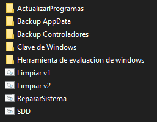

# 🖥️ Funciones.bat + PowerShell

Colección de scripts en **Batch (.bat)** y **PowerShell (.ps1)** para automatizar tareas de mantenimiento y optimización en Windows.  
Incluye utilidades para respaldo, limpieza, reparación y evaluación del sistema.

---

## 🚀 Funciones incluidas
- 🔄 **ActualizarProgramas** → Actualiza aplicaciones instaladas.
- 📂 **Backup AppData** → Copia de seguridad de configuraciones de usuario.
- 💾 **Backup Controladores** → Exporta drivers del sistema.
- 🔑 **Clave de Windows** → Muestra la licencia instalada.
- 📊 **Herramienta de evaluación de Windows** → Ejecuta `winsat` para medir rendimiento.
- 🧹 **Limpiar v1 y v2** → Scripts de limpieza de archivos temporales y caché.
- 🛠️ **RepararSistema** → Corrección de errores comunes en Windows.
- ⚡ **SSD** → Optimización de discos (TRIM, desactivar Indexado, Superfetch, Prefetch, ClearPageFileAtShutdown, activar caché de escritura).
- 🧠 **Memoria Virtual** → Activar, desactivar o mover el archivo de paginación según la RAM instalada.

---

## ▶️ Uso
1. Descarga el repositorio.
2. Ejecuta el archivo `Funciones.bat` como **Administrador**.
3. Selecciona la opción desde el menú interactivo.

---

## 📸 Vista previa
*(Agrega aquí una captura o GIF del menú para que se vea más atractivo)*  
Ejemplo:  

---

## 👨‍💻 Autor
Creado por **Marcelo (MarcheBMPC)**

---

## 📜 Licencia
Este proyecto está bajo la licencia **MIT**.  
Puedes usarlo y modificarlo libremente, siempre dando crédito al autor.

